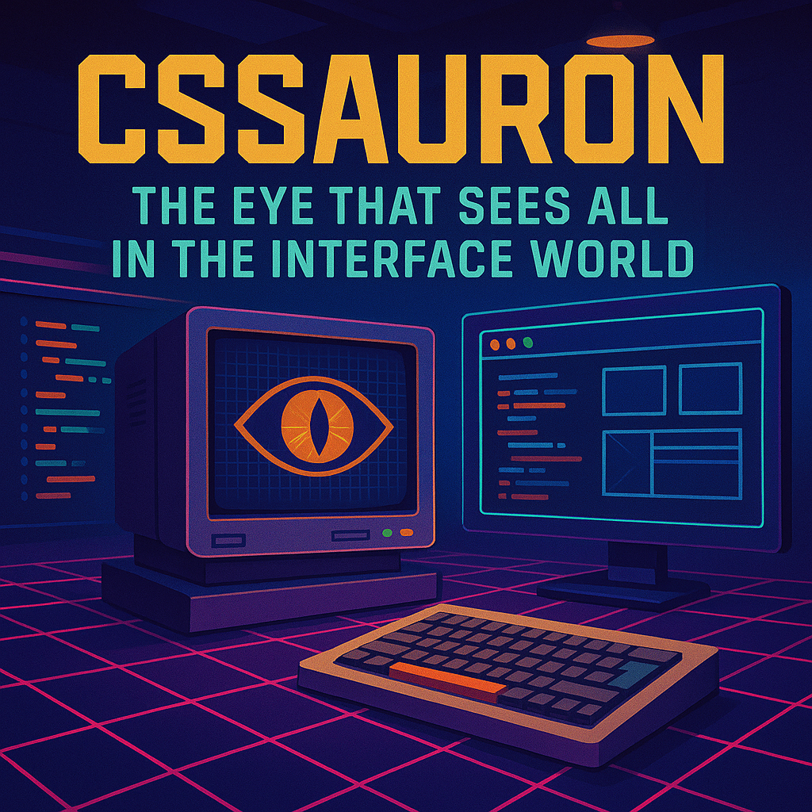

    Preview do podcast

    <audio src="./output/ElevenLabs_editado.MP3" controls title="Podcast editado"></audio>

# Projeto Podcast Gerado por I.A.s

Projeto com o objetivo de gerar um podcast utilizando IAs populamente conhecidas atualmente.

Este projeto foi criado por meio de uma atividade proposta no curso - Microsoft 50 Anos - Prompts Inteligentes - na [Dio.me](https://www.dio.me/)

## 💻 Tecnologias usadas

-   [ChatGPT](https://chat.openai.com/)
-   [ElevenLabs](https://beta.elevenlabs.io/)
-   [Capcut](https://www.capcut.com/pt-br/)

## 🤖 Como foi feito ?

-   Roteiro + imagem gerado via chatgpt
-   Audio gerado pela elevenLabs
-   Capcut para tratar aúdio e adicionar sons de fundo

## 📚 Materiais de apoio usados ->

-   [Notion Template](https://helpful-jump-17b.notion.site/PAS-Podcast-AI-Studio-210489e15d7a4a73b743bb159e45d06f?pvs=4)

## ⏯️ Como ouvir?

Para ouvir o podcast, basta acessar a pasta output/ -> e reproduzir o arquivo "ElevenLabs_editado.MP3"

## 👨‍💻 Criador

    
&nbsp&nbsp&nbspPetter Santos 
    &nbsp&nbsp&nbsp
    <a 
        href="https://github.com/BlackoutFox">
        GitHub
    </a>
    &nbsp;|&nbsp;
    <a 
        href="www.linkedin.com/in/pettersantos">
        LinkedIn
    </a>
    &nbsp;|&nbsp;
    <a 
        href="https://www.instagram.com/p.petters/">
        Instagram
    </a>
    &nbsp;|&nbsp;

  

